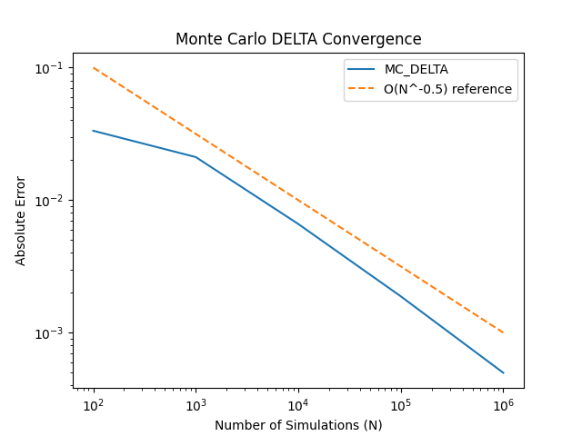
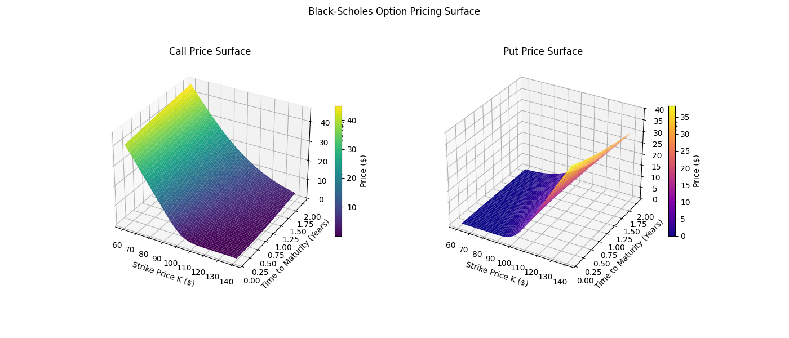

# European Option Pricing Engine

A European option is a financial contract giving the holder the right, but not the 
obligation, to buy (call) or sell (put) an underlying asset at a fixed strike price 
on a specific expiry date. Pricing these contracts fairly is a fundamental problem 
in quantitative finance — one that sits at the intersection of probability theory, 
stochastic calculus, and numerical methods.

---

## Overview

This project builds a complete European option pricing engine from first principles, implementing and validating multiple pricing methodologies:

- **Geometric Brownian Motion (GBM)** to model stock price evolution under risk-neutral pricing
- **Black-Scholes formula** derived via Itô's Lemma — a closed-form analytical solution
- **Monte Carlo simulation** as a numerical alternative, averaging thousands of simulated stock paths
- **Antithetic variates** for variance reduction — achieving lower error at the same computational cost
- **Option Greeks** computed analytically (BS) and numerically (finite differences on MC)
- **3D pricing surface** visualising call and put prices across all strikes and maturities

---
> This is my first quantitative finance project, built from scratch with no prior Python or finance experience.

## Project Structure
```
European-Option-Pricing-Engine/
├── src/
│   ├── black_scholes.py       # Analytical BS pricer
│   ├── monte_carlo.py         # MC simulation pricer
│   ├── variance_reduction.py  # Antithetic variates implementation
│   └── greeks.py              # BS analytical Greeks and MC delta
├── results/
│   └── plots/
│       ├── convergence.png    # MC vs BS price convergence
│       ├── delta.png          # MC vs BS delta convergence
│       └── options_surface.png # 3D pricing surface
├── main.py                    # Entry point — runs all pricing and plots
├── requirements.txt           # Dependencies
└── README.md
```


### What This Project Demonstrates
| Component | Method | Key Result |
|-----------|--------|------------|
| Option Pricing | Black-Scholes & Monte Carlo | MC converges to BS at O(N⁻¹/²) |
| Variance Reduction | Antithetic Variates | 33% reduction in standard error at same N |
| Sensitivities | BS Greeks & MC Finite Differences | MC delta converges to BS delta at O(N⁻¹/²) |
| Pricing Landscape | 3D BS Surface | Full call/put surface across strike and maturity |

---

## Key Results

# Default Parameters

| Parameter | Symbol | Value | Description |
|-----------|--------|-------|-------------|
| Spot price | S₀ | 100 | Current stock price |
| Strike price | K | 100 | At-the-money |
| Risk-free rate | r | 0.05 | 5% annual |
| Dividend yield | q | 0.00 | No dividends |
| Volatility | σ | 0.20 | 20% implied vol |
| Maturity | T | 1.0 | 1 year |

| Method | Price | Std Error | 95% CI |
|--------|-------|-----------|--------|
| Black-Scholes (Analytical) | 10.4506 | — | — |
| Monte Carlo (N=10,000) | 10.5515 | 0.1566 | (10.2446, 10.8584) |
| Antithetic Variates (N=10,000) | 10.4692 | 0.1044 | (10.2646, 10.6738) |

| Greek | BS Analytical | MC Finite Diff | Difference |
|-------|--------------|----------------|------------|
| Delta | 0.6368 | 0.6432 | 0.0063 |
| Gamma | 0.0188 | — | — |
| Vega | 37.5240 | — | — |
| Theta | -6.4140 | — | — |
| Rho | 53.2325 | — | — |


## Black–Scholes (Analytical) Pricer

We use the **Black–Scholes formula** as the benchmark “true” price for a European option because it is an **analytical (closed-form)** solution: it returns the fair value directly (no simulation noise). Starting from the same **GBM** stock model and applying **Itô’s Lemma**, the Black–Scholes price follows from **risk-neutral pricing** (no-arbitrage).

Under risk-neutral pricing, we replace the real-world drift with **r − q**. This prevents arbitrage by ensuring that (after hedging away risk in the derivation) any locally risk-free position grows at the **risk-free rate r**. That’s why option values are **discounted** at r: future payoffs are priced as present values.

### Risk-neutral GBM
S_t\,dt+\sigma%20S_t\,dW_t)

### Inputs (what the function takes)
`black_scholes(S0, K, r, q, sigma, T, option_type)`

- `S0`: current spot price  
- `K`: strike price  
- `r`: risk-free rate (used for discounting)  
- `q`: continuous dividend yield  
- `sigma`: implied volatility  
- `T`: time to maturity (years)  
- `option_type`: `'call'` or `'put'`  

### Closed-form Black–Scholes solution
+(r-q+\tfrac12\sigma^2)T}{\sigma\sqrt{T}},\quad%20d_2=d_1-\sigma\sqrt{T})

-Ke^{-rT}N(d_2))

-S_0e^{-qT}N(-d_1))

### Validation: call–put parity (no-arbitrage check)
Call–put parity links calls and puts through the same discounted components. For the same input parameters **(S0, K, r, q, sigma, T)**, the prices must satisfy:


> Note: equations are forced to white (`\color{White}`), so they are best viewed in dark mode.

## Monte Carlo Simulation Pricer

Black–Scholes gives a closed-form benchmark price, but we also implement a **Monte Carlo (MC)** pricer as a numerical alternative. The idea is simple: simulate many possible terminal stock prices under the **risk-neutral GBM** model, compute the option payoff for each simulated path, then **discount the average payoff** back to today.

### Risk-neutral GBM (terminal price)
Under risk-neutral pricing the stock drift becomes `r - q`, and the terminal price has the closed-form simulation form:

T+\sigma\sqrt{T}Z\Big),\;\;Z\sim\mathcal{N}(0,1))

This lets us simulate `S_T` directly (one random draw per simulation), rather than stepping through time.

### Payoffs and discounting
For each simulated terminal price `S_T`, we compute the payoff:

- Call payoff: `max(S_T - K, 0)`
- Put payoff:  `max(K - S_T, 0)`

The MC price is the discounted average payoff:

}))

Discounting by `e^{-rT}` accounts for the **time value of money**: payoffs occur at expiry, so we convert them to present value using the risk-free rate.

### Estimator uncertainty (standard error + 95% CI)
Because MC is an estimator, it has sampling error. We report:

- **Standard error** (how much the estimate varies due to finite `N`)
- **95% confidence interval** using the normal approximation


where `s` is the sample standard deviation of the (discounted) payoff samples (we use `ddof=1`).

### Function inputs
`monte_carlo(S0, K, r, q, sigma, T, N, option_type, seed=1)`

- `S0`: current spot price  
- `K`: strike price  
- `r`: risk-free rate (discounting)  
- `q`: dividend yield (risk-neutral drift adjustment)  
- `sigma`: implied volatility  
- `T`: time to maturity (years)  
- `N`: number of simulations  
- `option_type`: `'call'` or `'put'`  
- `seed`: RNG seed (for reproducibility)

This function returns `(price, std_error, confidence_interval)`.

## Variance Reduction: Antithetic Variates

Standard Monte Carlo uses independent random draws `Z ~ N(0,1)` to simulate terminal prices and compute payoffs. The estimator is unbiased, but it can be noisy. **Antithetic variates** reduce this noise by pairing each draw `Z` with its mirror `-Z`, then averaging the two payoffs.

### Idea (what it is)
For each pair, we simulate two terminal prices using `Z` and `-Z`:

}=S_0\exp\Big((r-q-\tfrac12\sigma^2)T+\sigma\sqrt{T}\,Z\Big))

}=S_0\exp\Big((r-q-\tfrac12\sigma^2)T-\sigma\sqrt{T}\,Z\Big))

We compute the two payoffs and then take their average:
- Call: `0.5 * (max(ST_pos - K, 0) + max(ST_neg - K, 0))`
- Put:  `0.5 * (max(K - ST_pos, 0) + max(K - ST_neg, 0))`

This keeps the estimate unbiased, but typically lowers variance.

### Why variance goes down
The payoff from `Z` and the payoff from `-Z` tend to move in opposite directions (negative correlation). Averaging two negatively correlated samples cancels part of the randomness.

=\frac{1}{2}\mathrm{Var}(Y)\,(1+\rho))

Here, `rho` is the correlation between the paired payoffs. When `rho < 0`, the factor `(1 + rho)` is smaller, so the variance is lower.

### Variance Reduction Factor (VRF)
We report the **variance reduction factor**:

}{\mathrm{Var}(\mathrm{antithetic}\%20\mathrm{estimator})})

Interpretation:
- `VRF > 1` means antithetic variates reduced variance.
- `VRF = 2` means half the variance (or roughly half as many simulations needed for the same accuracy).
- If standard error drops by ~33%, variance drops by about `(1/0.67)^2 ≈ 2.2x` (since variance scales like SE^2).

### Function inputs / behaviour
`var_reduction(S0, K, r, q, sigma, T, N, option_type, seed=1)`

Implementation details:
- Generates `N//2` normal draws `Z`
- Uses both `Z` and `-Z` to create two terminal price arrays
- Averages paired payoffs, discounts by `exp(-rT)`, and returns `(price, std_error, confidence_interval)`
- Same compute budget as standard MC (one pair uses two terminal prices, but replaces two independent draws with a correlated pair)
## Convergence Plot (MC → Black–Scholes)


Monte Carlo pricing is an estimator, so its error decreases as the number of simulations `N` increases. In theory, the convergence rate is:

)

### What’s plotted
- **MC_Baseline**: absolute error `|MC_price − BS_price|`
- **Antithetic Variates**: absolute error `|AV_price − BS_price|`
- **Reference line**: a dashed curve proportional to `N^(-1/2)`

We use a **log–log plot** because power laws become straight lines; if error behaves like `N^(-1/2)`, the curve should be roughly parallel to the reference line.

### How we reduce noise in the plot
For each `N`, we run multiple seeds (`seed = run` for `run in range(N_RUNS)`) and average the absolute error. This “nested loop over seeds” doesn’t change the estimator; it just makes the convergence trend clearer and less dependent on one lucky/unlucky random draw.


### Results (interpretation of the convergence diagram)

- In the log–log diagram above, both the **MC_Baseline** (blue) and **Antithetic Variates** (orange) curves appear approximately linear and run parallel to the dashed `N^(-1/2)` reference. This confirms the estimator’s error decays at the theoretical Monte Carlo rate `O(N^(-1/2))`.

- The dashed green line represents slope only (not magnitude). The vertical gap between the curves and the reference reflects the variance constant in  
  `Error ≈ C / sqrt(N)`.

- The orange antithetic curve lies consistently below the blue baseline curve while remaining parallel. This shows that variance reduction does **not** change the convergence order, but lowers the multiplicative constant `C`, producing smaller error for the same simulation budget.

- As `N` increases from 10^2 to 10^6, both curves become smoother and the slope stabilises, indicating entry into the asymptotic regime where sampling noise behaves predictably.

Overall, the diagram demonstrates that:
1. Monte Carlo pricing converges to Black–Scholes at the correct theoretical rate.
2. Antithetic variates reduces variance without altering convergence order.
3. The implementation behaves exactly as a correctly constructed Monte Carlo estimator should.
## Greeks (Risk Sensitivities)

In options, **Greeks** are the standard way to quantify **risk**: they measure how sensitive an option’s price is to small changes in key inputs. In this project we compute Greeks two ways:
- **Analytically (Black–Scholes)** as the benchmark “true” sensitivities.
- **Numerically (Monte Carlo)** by estimating **Delta** with finite differences, then checking it converges to the Black–Scholes Delta.

You don’t need to know every derivation in depth to use them — the key idea is that each Greek corresponds to a different type of risk exposure.

### What each Greek measures (brief)
- **Delta (Δ)**: exposure to spot price moves (`S0`). “How much does the option price move if the stock moves $1?”
- **Gamma (Γ)**: how fast Delta changes as spot moves. High Gamma = Delta shifts quickly (nonlinear risk).
- **Vega (ν)**: exposure to volatility changes (`sigma`). “How much does the option price change if implied vol changes?”
- **Theta (Θ)**: time decay. “How much value is lost as expiry approaches, holding everything else fixed?”
- **Rho (ρ)**: exposure to interest rate changes (`r`) via discounting.

### Black–Scholes Greeks (analytical benchmark)
We compute the Greeks in `bs_greeks()` using the closed-form Black–Scholes expressions. These serve as the ground-truth risk sensitivities for validation.

### Monte Carlo Delta (finite-difference estimate)
We estimate Delta numerically by “bumping” the spot price up and down by a small amount `h` and applying a central difference:

-\hat{V}(S_0-h)}{2h})

This is implemented in `mc_delta()` by calling the Monte Carlo pricer at `S0 + h` and `S0 - h`.

---

## Delta Convergence (MC Delta → BS Delta)



### What’s plotted
- **Absolute error** between Monte Carlo Delta and Black–Scholes Delta as `N` increases.
- We use a **log–log scale** to make the theoretical Monte Carlo rate visible.

Monte Carlo Delta is still a Monte Carlo estimator, so its sampling error decreases at the same theoretical rate:

)

### Results (interpretation of the Delta convergence diagram)

- In the log–log diagram above, the **MC_DELTA** curve (blue) is approximately linear and runs parallel to the dashed `N^(-1/2)` reference. This confirms that the Monte Carlo Delta estimator converges at the same theoretical rate `O(N^(-1/2))` as the price estimator.

- The dashed orange line represents slope only. The vertical separation between the MC_DELTA curve and the reference reflects the variance constant in  
  `Error ≈ C / sqrt(N)`.

- As `N` increases from 10^2 to 10^6, the error decreases smoothly and predictably. The straight-line behaviour on the log–log scale indicates we are in the asymptotic regime where sampling error dominates.

- Importantly, this validates more than pricing accuracy: it shows that **risk sensitivity (Delta)** computed via finite differences on Monte Carlo prices converges correctly to the analytical Black–Scholes Delta.

Overall, the diagram demonstrates that:
1. Monte Carlo not only converges in price, but also in risk.
2. The finite-difference Delta estimator inherits the same `N^(-1/2)` convergence behaviour.
3. The implementation is numerically stable and consistent with Monte Carlo theory.

## Option Pricing Surface (Geometric View of Black–Scholes)



To go beyond single-point pricing, we visualise the full Black–Scholes pricing landscape across a grid of strikes and maturities. Using the same closed-form pricer from earlier sections, we compute:
- 50 strike values from `K = 60` to `K = 140`
- 50 maturities from `T = 0.1` to `T = 2.0` years

This produces two 3D surfaces:
- **Call surface:** `C(K, T)`
- **Put surface:** `P(K, T)`

### Why this matters (link to earlier work)
This surface is generated from the same Black–Scholes benchmark model used for:
- Monte Carlo price convergence (`MC → BS`)
- Antithetic variance reduction
- Delta convergence (`MC Delta → BS Delta`)

Instead of validating at one parameter set, the surface lets you *see* how price changes across market conditions (moneyness and time).

### What the diagram shows
From the plotted surfaces:
- **Call prices decrease as `K` increases** (harder to finish in-the-money).
- **Put prices increase as `K` increases** (more downside protection value).
- **Both surfaces generally rise with `T`** (more time for favourable moves).
- In deep ITM/OTM regions the surfaces flatten toward intrinsic-value-like behaviour.

### Geometric interpretation of call–put parity
Call–put parity is the no-arbitrage identity used earlier to verify the Black–Scholes implementation:


Geometrically, parity says the **vertical gap** between the call surface and put surface at the same `(K, T)` is *not arbitrary*. For every grid point, `C(K,T) - P(K,T)` must equal the deterministic value set by:
- the dividend-adjusted stock term `S0 * exp(-qT)`, and
- the discounted strike term `K * exp(-rT)`.

So parity is more than a single-number check: it constrains the relationship between the two surfaces **everywhere** on the grid.

## Assumptions & Limitations (and what they mean)

This project is built to demonstrate a complete **European option pricing workflow** under the classical Black–Scholes/GBM framework:
- use **Black–Scholes** as an analytical benchmark (“true price” *under the model*),
- show **Monte Carlo** converges to that benchmark at the theoretical `O(N^(-1/2))` rate,
- reduce estimator variance with **antithetic variates**,
- and validate **risk (Delta)** by showing MC Delta converges to the Black–Scholes Delta.

Because Black–Scholes is the benchmark throughout, the project inherits the key assumptions of that model.

### Core model assumptions
- **Constant volatility (`sigma` is fixed):**  
  **Meaning:** the model assumes the underlying’s volatility does not change with time or strike.  
  **Why it matters:** real markets exhibit a *volatility smile/surface* (implied vol varies across strikes and maturities) and volatility changes through time (clustering). A single constant `sigma` cannot match the full surface, so Black–Scholes will misprice options away from the calibration point (especially deep OTM puts/calls) and Greeks won’t reflect smile dynamics.

- **GBM / lognormal returns (continuous paths, no jumps):**  
  **Meaning:** the stock is modelled with continuous Brownian motion dynamics.  
  **Why it matters:** real prices can gap on news/earnings and have fat tails. GBM typically understates extreme moves, which can materially affect option values and tail-risk.

- **Constant rates (`r`) and dividend yield (`q`):**  
  **Meaning:** discounting and carry are treated as constant over the option life.  
  **Why it matters:** in reality rates have term structure and can move; dividends may be discrete/uncertain. This mainly impacts longer-dated options and carry-sensitive pricing.

- **Frictionless markets (derivation idealisation):**  
  **Meaning:** the theory assumes no transaction costs and continuous hedging is possible.  
  **Why it matters:** real hedging is discrete and costly; with jumps and costs, “perfect replication” breaks, so the model is an approximation.

### Product scope limitations
- **European options only:** no early exercise logic (so not directly applicable to American options).
- **Not calibrated to market data:** the 3D surface is the Black–Scholes surface over `(K, T)` at fixed `(S0, r, q, sigma)`, not a market-implied volatility surface.

### Numerical limitations (Monte Carlo + Greeks)
- **Monte Carlo converges slowly:** error scales like `1/sqrt(N)`, so 10× less error needs ~100× more simulations.
- **95% CI is approximate:** using `estimate ± 1.96 * SE` relies on large-sample normality; for small `N` and skewed payoffs it’s an approximation.
- **Finite-difference Delta depends on bump size `h`:** large `h` introduces bias; tiny `h` increases noise and numerical cancellation. The estimate is still valid, but accuracy depends on choosing `h` sensibly relative to `S0` and `N`.

In short: the engine is **correct and internally consistent under the Black–Scholes/GBM assumptions**, and the experiments (price convergence, variance reduction, delta convergence) validate the expected numerical behaviour. The limitations are primarily about realism versus what actual option markets exhibit (smile, jumps, time-varying parameters).
