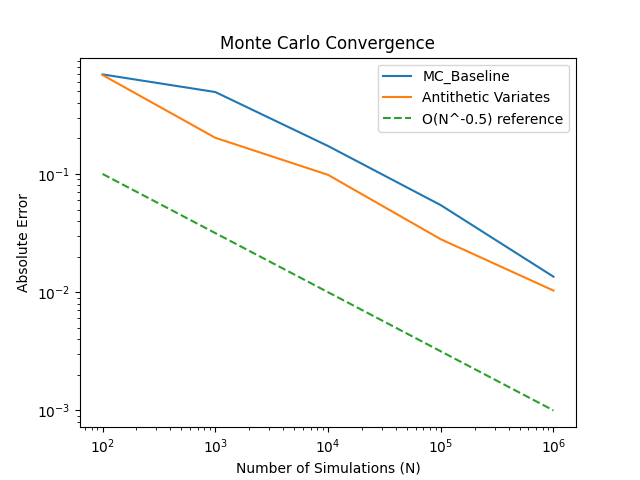

# European Option Pricing Engine

A European option is a financial contract giving the holder the right, but not the 
obligation, to buy (call) or sell (put) an underlying asset at a fixed strike price 
on a specific expiry date. Pricing these contracts fairly is a fundamental problem 
in quantitative finance — one that sits at the intersection of probability theory, 
stochastic calculus, and numerical methods.

---

## Overview

This project builds a complete European option pricing engine from first principles, implementing and validating multiple pricing methodologies:

- **Geometric Brownian Motion (GBM)** to model stock price evolution under risk-neutral pricing
- **Black-Scholes formula** derived via Itô's Lemma — a closed-form analytical solution
- **Monte Carlo simulation** as a numerical alternative, averaging thousands of simulated stock paths
- **Antithetic variates** for variance reduction — achieving lower error at the same computational cost
- **Option Greeks** computed analytically (BS) and numerically (finite differences on MC)
- **3D pricing surface** visualising call and put prices across all strikes and maturities

---
> This is my first quantitative finance project, built from scratch with no prior Python or finance experience.

## Project Structure
```
European-Option-Pricing-Engine/
├── src/
│   ├── black_scholes.py       # Analytical BS pricer
│   ├── monte_carlo.py         # MC simulation pricer
│   ├── variance_reduction.py  # Antithetic variates implementation
│   └── greeks.py              # BS analytical Greeks and MC delta
├── results/
│   └── plots/
│       ├── convergence.png    # MC vs BS price convergence
│       ├── delta.png          # MC vs BS delta convergence
│       └── options_surface.png # 3D pricing surface
├── main.py                    # Entry point — runs all pricing and plots
├── requirements.txt           # Dependencies
└── README.md
```


### What This Project Demonstrates
| Component | Method | Key Result |
|-----------|--------|------------|
| Option Pricing | Black-Scholes & Monte Carlo | MC converges to BS at O(N⁻¹/²) |
| Variance Reduction | Antithetic Variates | 33% reduction in standard error at same N |
| Sensitivities | BS Greeks & MC Finite Differences | MC delta converges to BS delta at O(N⁻¹/²) |
| Pricing Landscape | 3D BS Surface | Full call/put surface across strike and maturity |

---

## Key Results

Running with parameters S₀=100, K=100, r=0.05, σ=0.20, T=1.0, q=0.0:

| Method | Price | Std Error | 95% CI |
|--------|-------|-----------|--------|
| Black-Scholes (Analytical) | 10.4506 | — | — |
| Monte Carlo (N=10,000) | 10.5515 | 0.1566 | (10.2446, 10.8584) |
| Antithetic Variates (N=10,000) | 10.4692 | 0.1044 | (10.2646, 10.6738) |

| Greek | BS Analytical | MC Finite Diff | Difference |
|-------|--------------|----------------|------------|
| Delta | 0.6368 | 0.6432 | 0.0063 |
| Gamma | 0.0188 | — | — |
| Vega | 37.5240 | — | — |
| Theta | -6.4140 | — | — |
| Rho | 53.2325 | — | — |


## Black–Scholes (Analytical) Pricer

We use the **Black–Scholes formula** as the benchmark “true” price for a European option because it is an **analytical (closed-form)** solution: it returns the fair value directly (no simulation noise). Starting from the same **GBM** stock model and applying **Itô’s Lemma**, the Black–Scholes price follows from **risk-neutral pricing** (no-arbitrage).

Under risk-neutral pricing, we replace the real-world drift with **r − q**. This prevents arbitrage by ensuring that (after hedging away risk in the derivation) any locally risk-free position grows at the **risk-free rate r**. That’s why option values are **discounted** at r: future payoffs are priced as present values.

### Risk-neutral GBM
S_t\,dt+\sigma%20S_t\,dW_t)

### Inputs (what the function takes)
`black_scholes(S0, K, r, q, sigma, T, option_type)`

- `S0`: current spot price  
- `K`: strike price  
- `r`: risk-free rate (used for discounting)  
- `q`: continuous dividend yield  
- `sigma`: implied volatility  
- `T`: time to maturity (years)  
- `option_type`: `'call'` or `'put'`  

### Closed-form Black–Scholes solution
+(r-q+\tfrac12\sigma^2)T}{\sigma\sqrt{T}},\quad%20d_2=d_1-\sigma\sqrt{T})

-Ke^{-rT}N(d_2))

-S_0e^{-qT}N(-d_1))

### Validation: call–put parity (no-arbitrage check)
Call–put parity links calls and puts through the same discounted components. For the same input parameters **(S0, K, r, q, sigma, T)**, the prices must satisfy:


> Note: equations are forced to white (`\color{White}`), so they are best viewed in dark mode.

## Monte Carlo Simulation Pricer

Black–Scholes gives a closed-form benchmark price, but we also implement a **Monte Carlo (MC)** pricer as a numerical alternative. The idea is simple: simulate many possible terminal stock prices under the **risk-neutral GBM** model, compute the option payoff for each simulated path, then **discount the average payoff** back to today.

### Risk-neutral GBM (terminal price)
Under risk-neutral pricing the stock drift becomes `r - q`, and the terminal price has the closed-form simulation form:

T+\sigma\sqrt{T}Z\Big),\;\;Z\sim\mathcal{N}(0,1))

This lets us simulate `S_T` directly (one random draw per simulation), rather than stepping through time.

### Payoffs and discounting
For each simulated terminal price `S_T`, we compute the payoff:

- Call payoff: `max(S_T - K, 0)`
- Put payoff:  `max(K - S_T, 0)`

The MC price is the discounted average payoff:

}))

Discounting by `e^{-rT}` accounts for the **time value of money**: payoffs occur at expiry, so we convert them to present value using the risk-free rate.

### Estimator uncertainty (standard error + 95% CI)
Because MC is an estimator, it has sampling error. We report:

- **Standard error** (how much the estimate varies due to finite `N`)
- **95% confidence interval** using the normal approximation


where `s` is the sample standard deviation of the (discounted) payoff samples (we use `ddof=1`).

### Function inputs
`monte_carlo(S0, K, r, q, sigma, T, N, option_type, seed=1)`

- `S0`: current spot price  
- `K`: strike price  
- `r`: risk-free rate (discounting)  
- `q`: dividend yield (risk-neutral drift adjustment)  
- `sigma`: implied volatility  
- `T`: time to maturity (years)  
- `N`: number of simulations  
- `option_type`: `'call'` or `'put'`  
- `seed`: RNG seed (for reproducibility)

This function returns `(price, std_error, confidence_interval)`.

## Variance Reduction: Antithetic Variates

Standard Monte Carlo uses independent random draws `Z ~ N(0,1)` to simulate terminal prices and compute payoffs. The estimator is unbiased, but it can be noisy. **Antithetic variates** reduce this noise by pairing each draw `Z` with its mirror `-Z`, then averaging the two payoffs.

### Idea (what it is)
For each pair, we simulate two terminal prices using `Z` and `-Z`:

}=S_0\exp\Big((r-q-\tfrac12\sigma^2)T+\sigma\sqrt{T}\,Z\Big))

}=S_0\exp\Big((r-q-\tfrac12\sigma^2)T-\sigma\sqrt{T}\,Z\Big))

We compute the two payoffs and then take their average:
- Call: `0.5 * (max(ST_pos - K, 0) + max(ST_neg - K, 0))`
- Put:  `0.5 * (max(K - ST_pos, 0) + max(K - ST_neg, 0))`

This keeps the estimate unbiased, but typically lowers variance.

### Why variance goes down
The payoff from `Z` and the payoff from `-Z` tend to move in opposite directions (negative correlation). Averaging two negatively correlated samples cancels part of the randomness.

=\frac{1}{2}\mathrm{Var}(Y)\,(1+\rho))

Here, `rho` is the correlation between the paired payoffs. When `rho < 0`, the factor `(1 + rho)` is smaller, so the variance is lower.

### Variance Reduction Factor (VRF)
We report the **variance reduction factor**:

}{\mathrm{Var}(\mathrm{antithetic}\%20\mathrm{estimator})})

Interpretation:
- `VRF > 1` means antithetic variates reduced variance.
- `VRF = 2` means half the variance (or roughly half as many simulations needed for the same accuracy).
- If standard error drops by ~33%, variance drops by about `(1/0.67)^2 ≈ 2.2x` (since variance scales like SE^2).

### Function inputs / behaviour
`var_reduction(S0, K, r, q, sigma, T, N, option_type, seed=1)`

Implementation details:
- Generates `N//2` normal draws `Z`
- Uses both `Z` and `-Z` to create two terminal price arrays
- Averages paired payoffs, discounts by `exp(-rT)`, and returns `(price, std_error, confidence_interval)`
- Same compute budget as standard MC (one pair uses two terminal prices, but replaces two independent draws with a correlated pair)
## Convergence Plot (MC → Black–Scholes)



Monte Carlo pricing is an estimator, so its error decreases as the number of simulations `N` increases. In theory, the convergence rate is:

)

### What’s plotted
- **MC_Baseline**: absolute error `|MC_price − BS_price|`
- **Antithetic Variates**: absolute error `|AV_price − BS_price|`
- **Reference line**: a dashed curve proportional to `N^(-1/2)`

We use a **log–log plot** because power laws become straight lines; if error behaves like `N^(-1/2)`, the curve should be roughly parallel to the reference line.

### How we reduce noise in the plot
For each `N`, we run multiple seeds (`seed = run` for `run in range(N_RUNS)`) and average the absolute error. This “nested loop over seeds” doesn’t change the estimator; it just makes the convergence trend clearer and less dependent on one lucky/unlucky random draw.

### Results (what the plot shows)
- **Both methods follow the expected `N^(-1/2)` slope** (they track the reference line), which empirically validates the theoretical Monte Carlo convergence rate.
- **Antithetic variates sits below baseline MC** across `N`: it reduces variance, so you get **lower error for the same simulation budget** (same order of convergence, improved constant factor).
- As `N` grows large, both errors shrink predictably, but antithetic remains consistently better due to the negative-correlation pairing `Z` and `-Z`.
